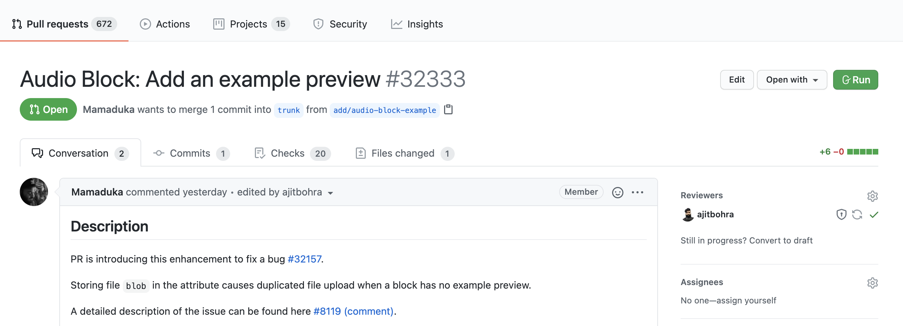

# Gutenberg Run
Chrome extention to directly run PR on gutenberg.run from github pull request

## Install

## Usage
- Open any pull request https://github.com/WordPress/gutenberg/pulls to see the run button 
- Click on the run button or press <kbd>r</kbd>

## Development 
To install the extension load the unpacked version in your Chrome browser by following these steps:

- Download or clone this repository
- Type chrome://extensions in the address bar
- Enable the Developer Mode switch in the top right corner
- Click the Load Unpacked Extension… utton
- Select the directory

## For More Gutenberg Goodies
Checkout https://blablablocks.com/

## Credits

[Ajit Bohra](https://twitter.com/ajitbohra)

##  Support Us

[LUBUS](http://lubus.in) is a web design agency based in Mumbai, India.

You can pledge on [patreon](https://www.patreon.com/lubus) to support the development & maintenance of various [opensource](https://github.com/lubusIN/) stuff we are building.

## License

`Gutenberg Run Extension` is an open-source software licensed under the [MIT](LICENSE)
